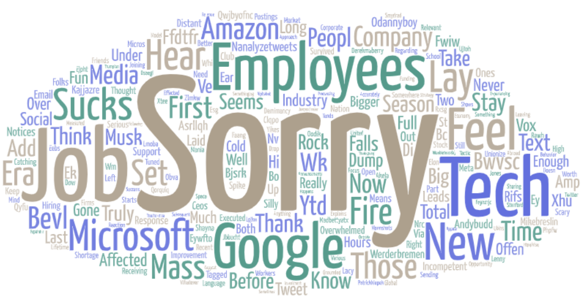
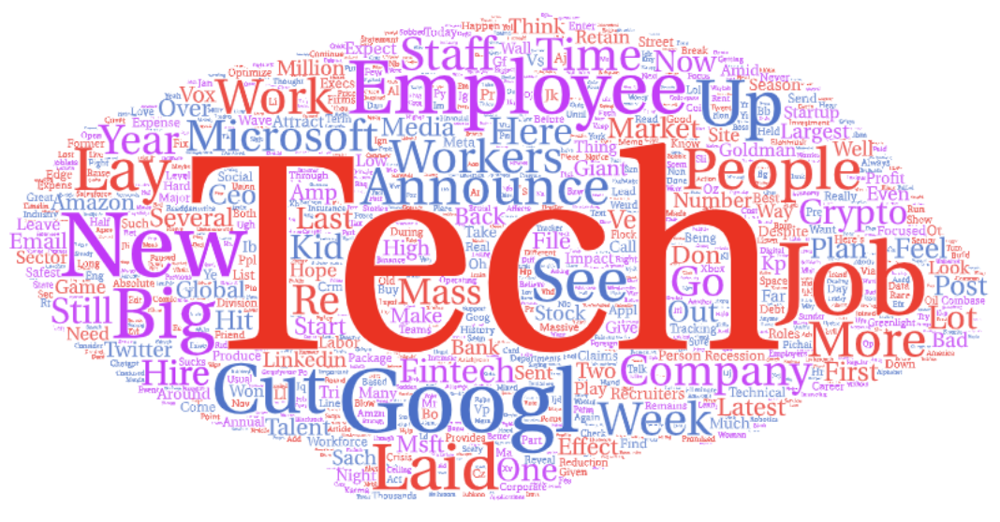

# Layoff-Tweet-Analysis

Repository for Winter 2023 [Geog 458: Advanced Digital Geography](https://github.com/jakobzhao/geog458)'s [Lab 2](https://github.com/jakobzhao/geog458/tree/master/labs/lab02) on playing with Twitter API.

### Seattle

[Right-click and choose "Save Link As"](https://raw.githubusercontent.com/Tj717/Layoff-Tweet-Analysis/main/assets/results.csv) to download the original dataset crawled from Twitter.  
***

### San Jose

[Right-click and choose "Save Link As"](https://raw.githubusercontent.com/Tj717/Layoff-Tweet-Analysis/main/assets/results2.csv) to download the original dataset crawled from Twitter.  
***

### Austin

[Right-click and choose "Save Link As"](https://raw.githubusercontent.com/Tj717/Layoff-Tweet-Analysis/main/assets/results3.csv) to download the original dataset crawled from Twitter.  
***

### New York

[Right-click and choose "Save Link As"](https://raw.githubusercontent.com/Tj717/Layoff-Tweet-Analysis/main/assets/results4.csv) to download the original dataset crawled from Twitter.
***

## Backstory
The idea of this comes from the recent news about the mass layoffs taking place in tech companies, I want to see reactions from people on Twitter as well as the general sentiment towards this event. Thus, the locations I chose for the search were Seattle, San Jose, Austin, and New York, which are filled with big-name tech companies. I set the radius of the search to 10 miles because I want more concentrated results and to avoid noise.

Looking at the word clouds, we can see that the biggest words, or the most frequent words in the tweets, are "layoff", "job", "tech", "employee", different company names, etc. Besides Austin's word cloud, the rest has very few words about emotions, and even if there are, they are way less frequent than the other words. Most of them are words used for factual statements and nouns. In contrast, Austin's word cloud contains many emotional words such as "sorry", "fun", "sucks", and "thank", which is really interesting. I suspect one reason that could attribute to this is the fact that Austin's dataset is the smallest, thus not containment by media reports and their retweets. Maybe the other 3 areas have a lot of media outlets sending tweets about the news around the layoffs while Austin has fewer local media covering this topic thus fewer tweets, I don't know.

This experiment could be improved by filtering by accounts, especially potential bots and spam accounts. Also, the location parameter could be optimized because some people tweet at their workplace, while the same people could tweet at their home, so assuming the tweets near the locations of the companies are from the employees are not accurate.

One thing I didn't expect is the number of company names mentioned. I knew some companies will get called out but it ended up happening a lot more often than I expected. Company names are easily among the top 5 most frequent words people mention in their tweets in all 4 regions. 

