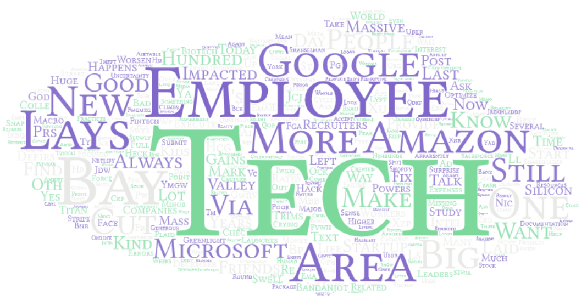

# Layoff-Tweet-Analysis

Repository for Winter 2023 [Geog 458: Advanced Digital Geography](https://github.com/jakobzhao/geog458)'s [Lab 2](https://github.com/jakobzhao/geog458/tree/master/labs/lab02) on playing with Twitter API.

## Seattle

[Click]() to download original dataset crawled from Twitter.

## San Jose

[Click]() to download original dataset crawled from Twitter.

## Austin

[Click]() to download original dataset crawled from Twitter.

## New York

[Click]() to download original dataset crawled from Twitter.

